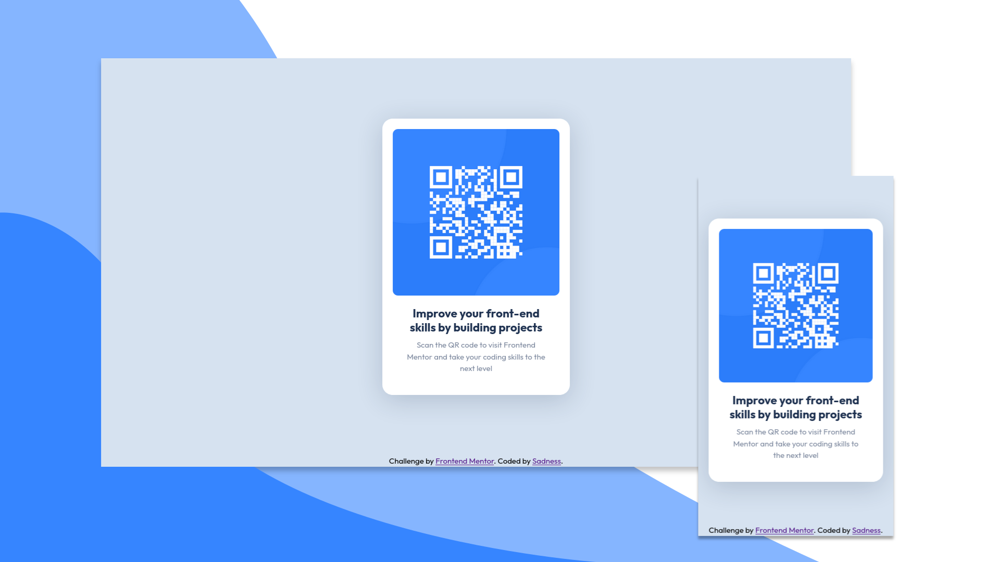

# Frontend Mentor - QR code component solution

This is a solution to the [QR code component challenge on Frontend Mentor](https://www.frontendmentor.io/challenges/qr-code-component-iux_sIO_H). Frontend Mentor challenges help you improve your coding skills by building realistic projects. 

## Table of contents

- [Overview](#overview)
  - [Screenshot](#screenshot)
  - [Links](#links)
- [My process](#my-process)
  - [Built with](#built-with)
  - [Useful resources](#useful-resources)

## Overview

### Screenshot

### Links

- Solution URL: [github.com/alperenisa/fem-qrcode](https://github.com/alperenisa/fem-qrcode)
- Live Site URL: [alperenisa.github.io/fem-qrcode](https://alperenisa.github.io/fem-qrcode)

## My process

### Built with

- Semantic HTML5 markup
- CSS custom properties
- Flexbox
- [SUIT CSS design principles](https://github.com/suitcss/suit/blob/master/doc/design-principles.md)

### Useful resources

- [SUIT CSS](https://github.com/suitcss/suit/blob/master/doc/design-principles.md)
- [CSS Guidelines](https://cssguidelin.es/)